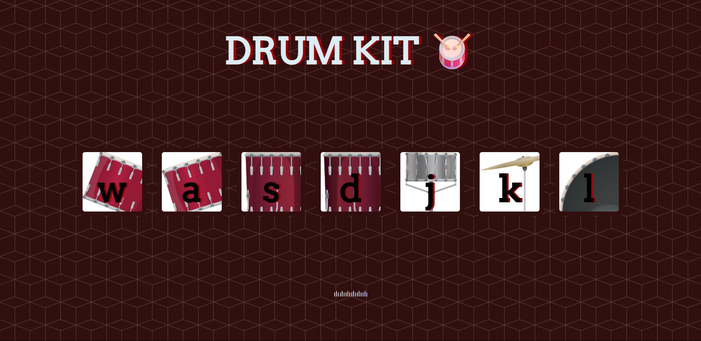

# 🥁 Drum Kit

An interactive drum kit built using HTML, CSS, and JavaScript. Press keys or click the buttons to play different drum sounds.

## How to Run

1. Download the following files :
   - `index.html`
   - `styles.css`
   - `index.js`
   - ' images '
   - ' sounds '

2. Open `index.html` in any web browser.

3. Press keys (`w`, `a`, `s`, `d`, `j`, `k`, `l`) or click the drum buttons to play sounds.

## Preview

## Features

- Keyboard-controlled drum sounds
- Animated button effects
- Fun and responsive design

---

Made for fun and learning!
